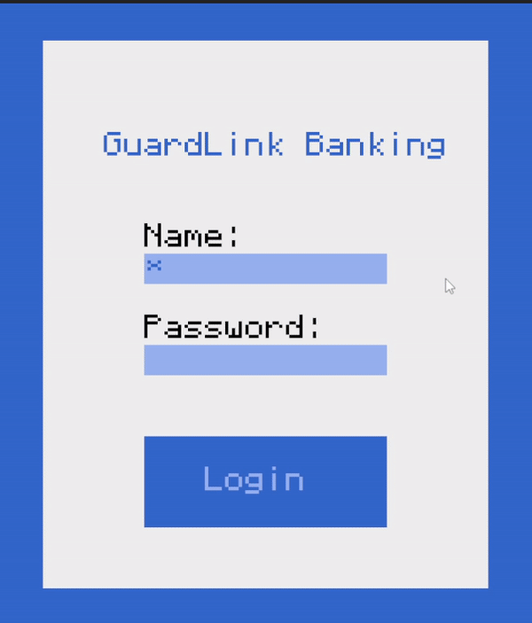

# ⚠️ WARNING: Project is being rewritten, its not gonna work

# GuardLink

GuardLink is a RP toolkit and "nation" simulator providing various systems for accounts, economies, laws and more. Everything happens on a centralized server and players interact with the systems via pocket computers. Admins will be able to manage the systems through an interface on the computer or remotely through their account. Each server simulates a country/nation/empire with features such as:

- Accounts & Identities (done)
- Wallets & Currencies (done)
- Properties & Real Estate
- Companies & Jobs
- Interactions between other computers (trade, diplomacy, currency exchange etc)
- Setup wizard (done)

Some features do not work with every government type/ethic.

External Libraries:
- [RSA Key generator](https://gist.github.com/1lann/c9d4d2e7c1f825cad36b)
- [SHA256-Algorithm](https://pastebin.com/6UV4qfNF)
- [Basalt (UI Library)](https://basalt.madefor.cc/#/)
- [Simple XML-Parser for lua](https://github.com/Cluain/Lua-Simple-XML-Parser)
- [pixelbox](https://github.com/9551-Dev/pixelbox_lite)
- [AES Encrypt library](https://forums.computercraft.cc/index.php?topic=487.0)
- [LibDeflate](https://github.com/safeteeWow/LibDeflate?tab=readme-ov-file)
Note: All libraries except for RSA Key generator are unmodified

Installation:
- 
```
no installer as of now
```


## Demo




## License

This project is licensed under the [MIT License](https://choosealicense.com/licenses/mit/)
